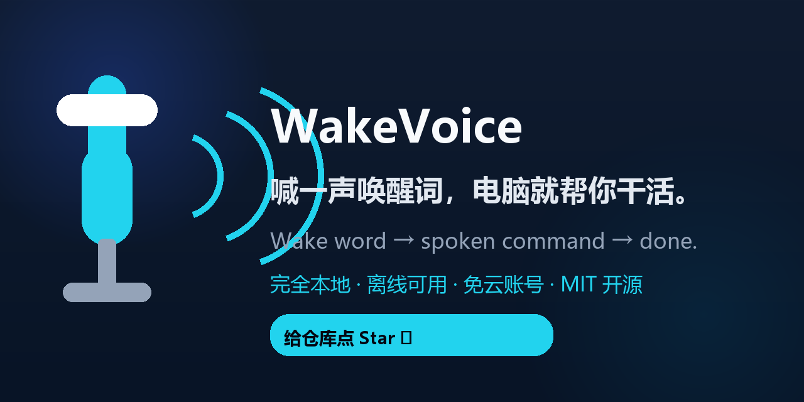
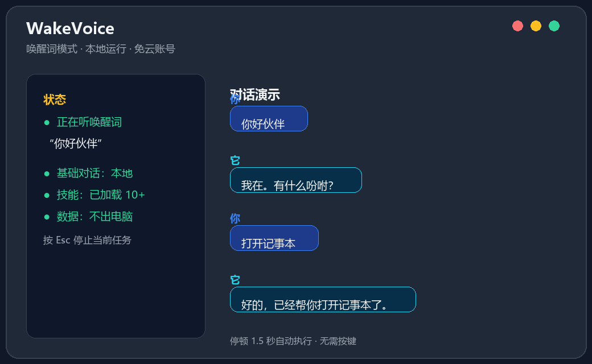

<div align="center">

# 🎙️ WakeVoice Portable

**免安装 Python 的绿色便携中文语音助手。**

下载 → 解压 → 双击 `WakeVoiceDesktop.exe`，就能对着电脑说话让它干活。唤醒、识别、基础对话全部在本地运行，断网也能用，隐私不出门。

> 💬 Wake word → spoken command → done. No Python · No install · No cloud.

[](https://github.com/jsxxwhai/wakevoice-portable/releases)
[](LICENSE)
[](https://github.com/jsxxwhai/wakevoice-portable)

</div>

> ⭐ **这个项目对你有用的话，请点一个 Star** —— 你的支持是作者持续更新的最大动力。

本仓库是**便携分发包**：`WakeVoiceDesktop.exe` + 完整运行库，无需安装 Python。完整源码、构建脚本与开发文档请看主仓库 [wakevoice](https://github.com/jsxxwhai/wakevoice)。





## 快速开始（两步）

1. 下载最新 [Release](https://github.com/jsxxwhai/wakevoice-portable/releases) 里的 `WakeVoiceDesktop-portable-vX.zip`。
2. 解压后双击 `WakeVoiceDesktop.exe`：
   - 首次运行会自动下载约 42MB 中文语音模型（显示进度，之后可离线使用）；
   - 完成后自动进入监听，说 **“你好伙伴”** → 它答“我在” → 说出指令 → 停顿 1.5 秒自动执行。

> 想停止当前任务，随时按 `Esc`。

## 系统要求

- Windows 10 / 11（64 位）
- 麦克风
- 首次运行需联网（下载语音模型），之后可离线

## 常用指令

- “打开记事本 / 打开计算器 / 打开 example.com”
- “现在几点 / 今天星期几”
- “读一下屏幕”（可选 OCR）
- “拜拜” 结束对话

## 配置与常见问题

- **自定义唤醒词**：用记事本打开程序目录 `config/config.yaml`，修改 `wake.word`。
- **接入大模型让回答更聪明**：在 `config/config.yaml` 的 `llm` 段配置 `base_url` / `api_key`（任意兼容 Chat Completions 的服务端点）或设置对应环境变量；不配置也能正常使用本地技能。
- 提示“Windows 已保护你的电脑” → 点“更多信息”→“仍要运行”（未签名程序的正常提示）。
- 完整中文说明书在压缩包内 `使用说明.txt`。

## 如何自己打包

便携版由主仓库一条命令产出：

```bash
python scripts/build_dist.py --clean --portable --zip
```

## 开源许可

[MIT](LICENSE) © WakeVoice Contributors
